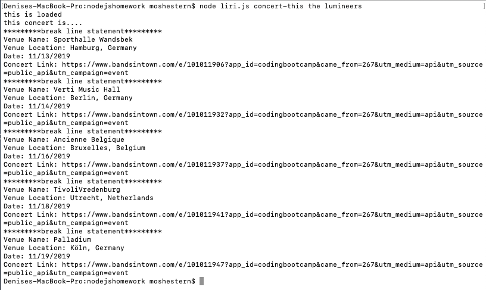
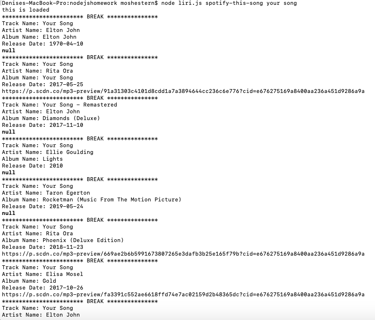
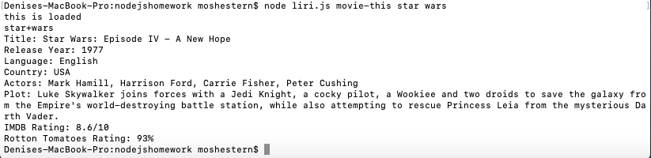
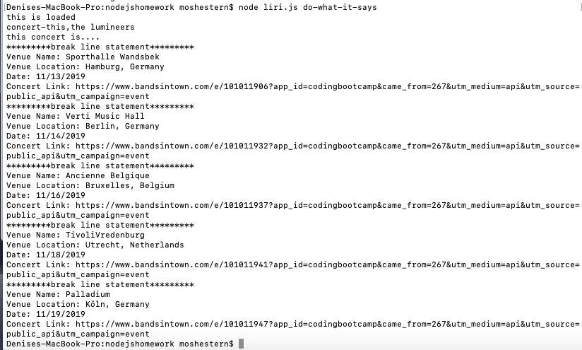
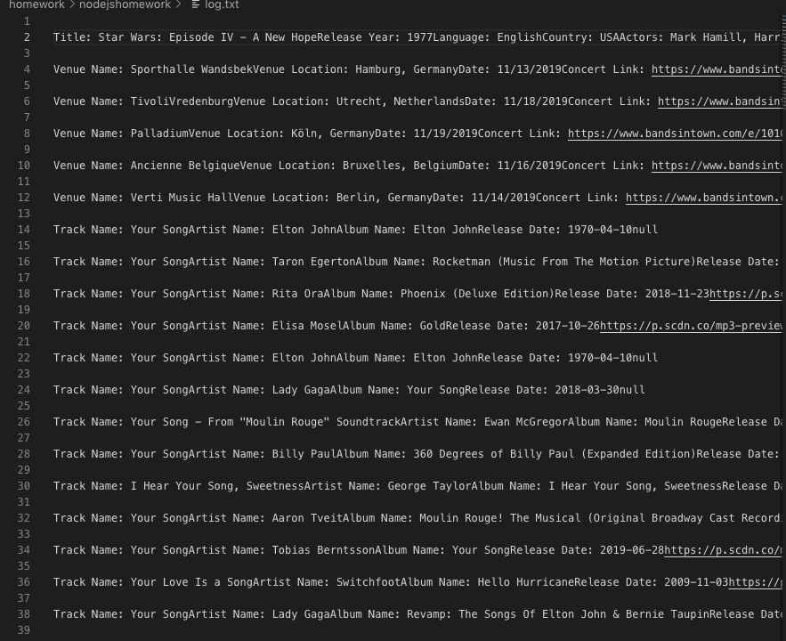

# nodejshomework - Liri

**Creator**: `Moshe Stern`

**Created on**: `Nov 12th 2019`

- - -

## ABOUT THE APP
LIRI is a Language Interpretation and Recognition Interface. LIRI is a command line node app that takes in parameters and gives back data. The user has the option of using four commands (listed below) in conjuntion with specific parameters associated with the commands. The  `Commands` are:

   * `concert-this`

   * `spotify-this-song`

   * `movie-this`

   * `do-what-it-says`

- - -
## HOW TO USE LIRI

### Prerequisits: 
fork repository, download, then npm install dotnev and create your own '.env' file that stores your spotify api key and secret id. 
ex: 
"# Spotify API keys

SPOTIFY_ID=your-spotify-id
SPOTIFY_SECRET=your-spotify-secret "
 - - -

### **Video Guide**

Watch the video here: https://drive.google.com/file/d/1bOplFkPx4wn-OSSr2FJnGthMlOQwSKL-/view

### **Step by Step instructions**

1. Open your terminal such as Bash.
2. Navigate to the folder that contains the `liri.js` file. 
3. Depending on the command you run, the output will vary. 

    **Example 1**: Run the `concert-this` command
    
        node liri.js concert-this <name of artist or band>
    
    Output: The system will display a list of all events and locations where the artist or band will perform. It can result in multiple records. The system will also log all the results in the log.txt file. See screen-shot below:

    

    **Example 2**: Run the `spotify-this-song` command
    
        node liri.js spotify-this-song <name of song>
    
    Output: The system will display a list of information associated with the song. It can result in multiple records. The system will also log all the results in the log.txt file. See screen-shot below:

    

    **Example 3**: Run the `movie-this` command
    
        node liri.js movie-this <name of movie>
    
    Output: The system will display information associated with the movie. The system will also log all the results in the log.txt file. See screen-shot below:

    

    **Example 4**: Run the `do-what-it-says` command
        
        node liri.js do-what-it-says
        
    Output: The system will read the text in the random.txt file, and perform the comman listed in the random.txt file. 
    
    See screen-shot below:

    

**Logging our search**: Open log.js 

Output: We have all our search results recorded for us here in log.js.

See screen-shot blow:

- - -

## TECHNOLOGIES USED
* Javascript
* Nodejs
* Node packages:
    * Node-Spotify-API
    * Request
    * Moment
    * DotEnv
* APIs used:
    * Bands in Town
    * OMDB
* Git
* GitHub

